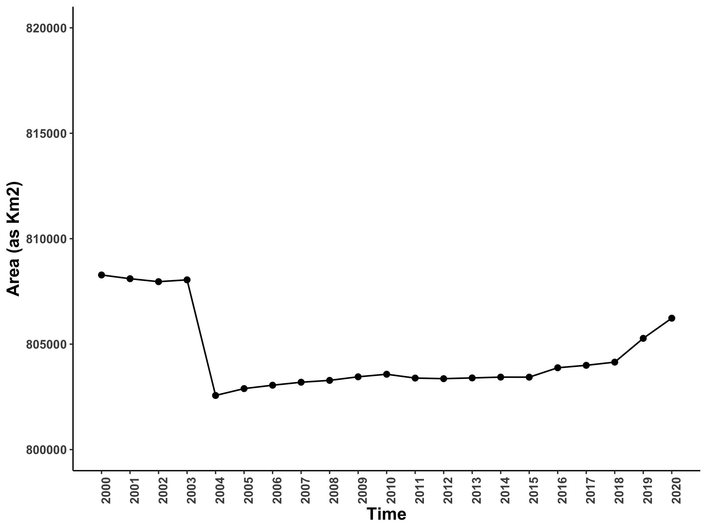
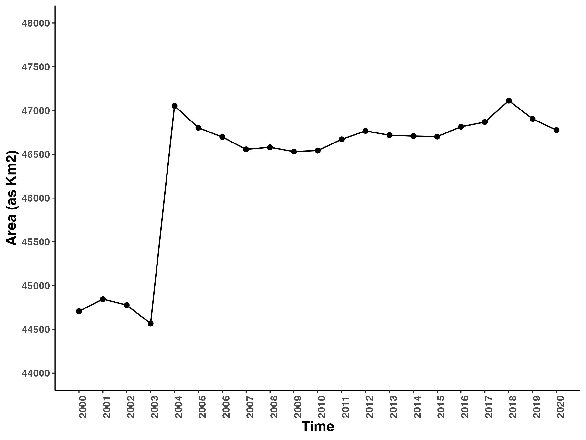
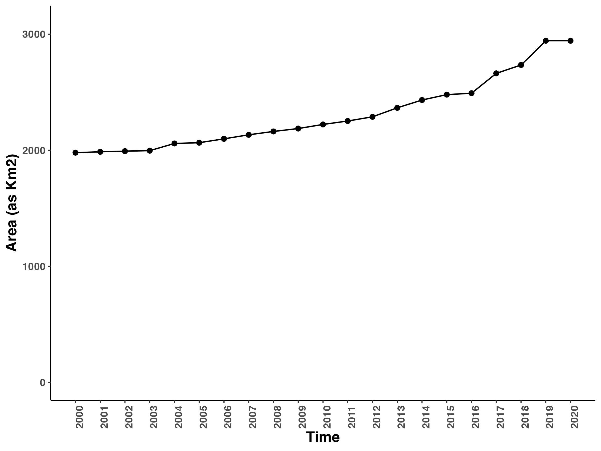
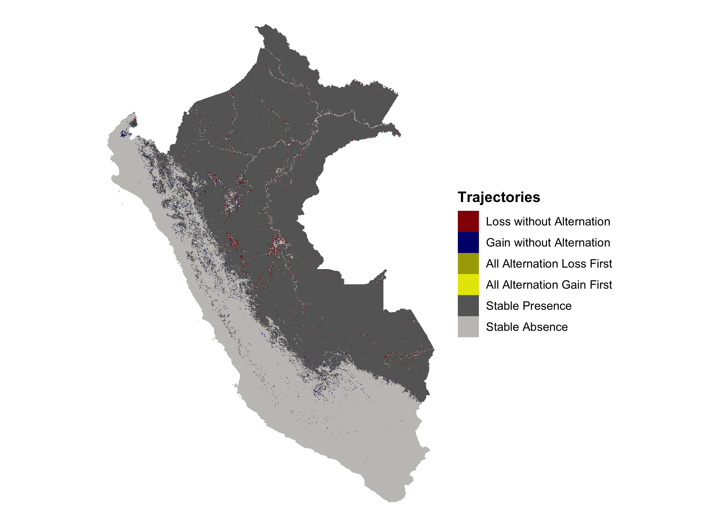
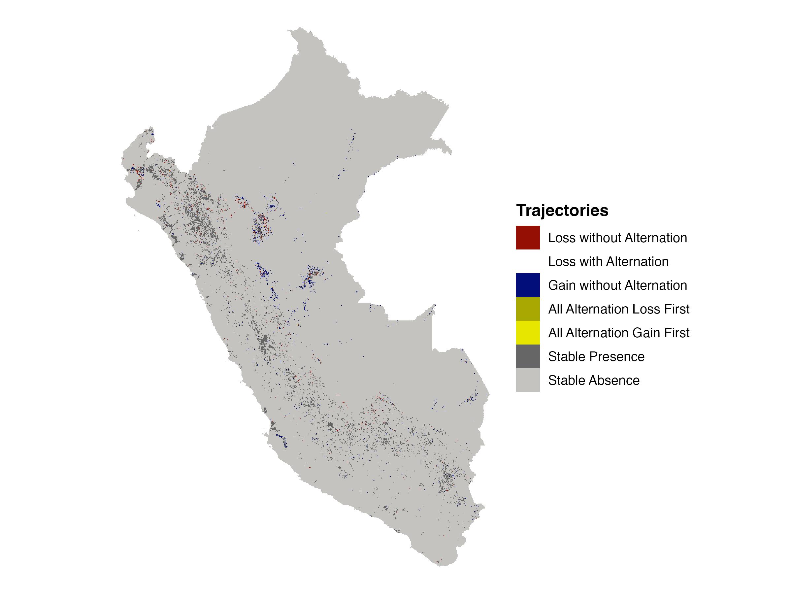
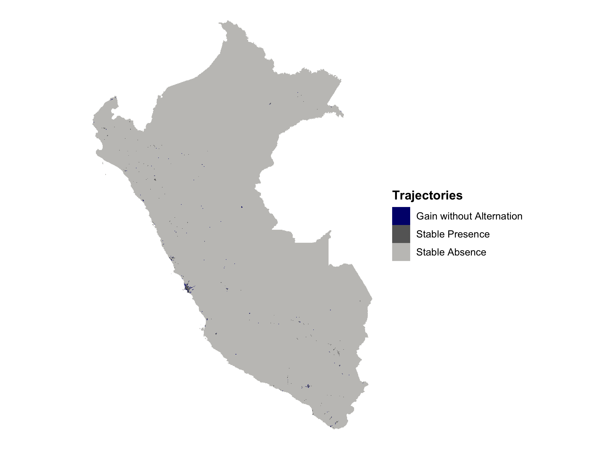
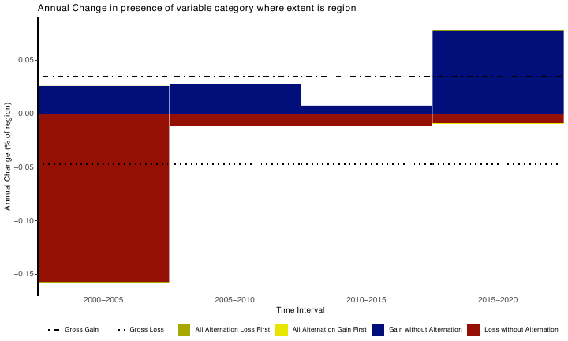
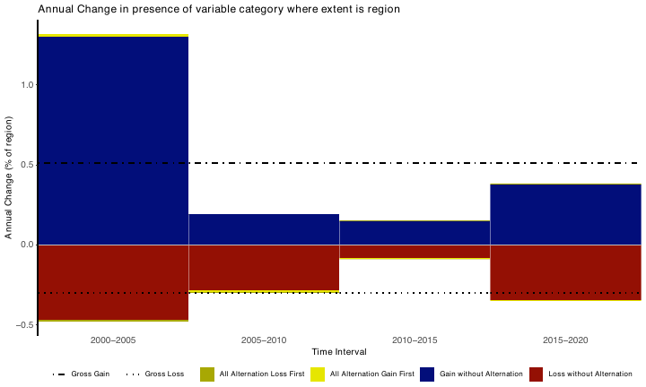
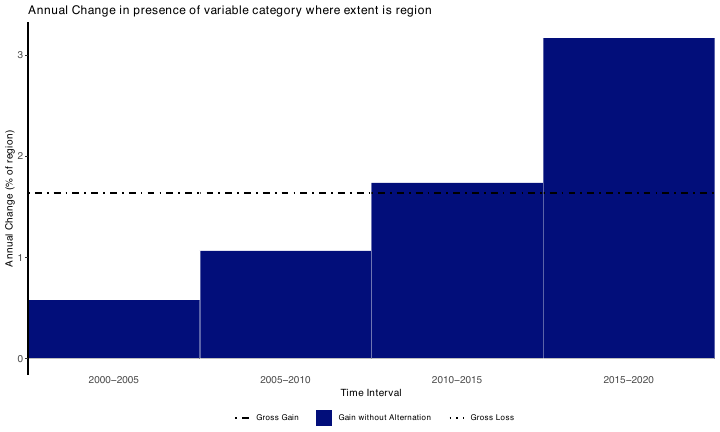

```{=html}
<style type="text/css">
  body {
    font-family: "Times New Roman", Times, serif;
    font-size: 12pt;
    line-height: 2.0;   
    text-align: justify; 
  }
  
  pre {
    line-height: 1.5;
  }
  .main-container {
  max-width: 940px; 
}
p {
    margin-bottom: 1.5em;
</style>
```

```{r, include = FALSE}
knitr::opts_chunk$set(
  collapse = TRUE,
  comment = "#>"
)

```

```{r, include = FALSE}
knitr::opts_chunk$set(
  collapse = TRUE,
  comment = "#>"
)
```

## Overall Land Cover Change Overview

As mentioned in the `Results/Approach` part, I created an animation by `gganimate` to see what are the major land cover types change generally. We can see the overview below (figure 1), in national scale, all these land cover types only had slightly change. However, if we look into  76˚W, 6˚S, there is an increasing of "Gold" over "Green". This means in that area, crop may replace the forest in a period of time. Another major change I found is along coastal line region, "red" dots were also growing. By using these information, I composed my hypothesis, **"The major land cover types change in Peru from 2000-2020 was the forest, the cropland, the built-ups."** This is also the reason why I focus on analyzing these three land cover types. 

```{r fig0-gif, echo=FALSE, out.width="55%", fig.cap="Figure 1. Animated overview of Peru’s land cover change from 2000 to 2020."}
knitr::include_graphics("../Project_Image/peru_land_cover.gif")
```

## Annual Area Change 

The first step I chose to use `plot_timeseries` function in `timeseriesTrajectories` package to get the annual land area of those specific land types. The plots can help me to see the area change of these land cover types through year-to-year trend. Also, it can be an evidence for supporting my hypothesis. Here is the code how I use this function.

```{r, eval=FALSE}
p_timeseries_forest <- plot_timeseries(
  forest_area,
  timepoints = years,
  vertunits = vert_units,
  xAngle = 0
)

p_timeseries_crop <- plot_timeseries(
  cropland_area,
  timepoints = years,
  vertunits = vert_units,
  xAngle = 0
)

p_timeseries_build <- plot_timeseries(
  builtup_area,
  timepoints = years,
  vertunits = vert_units,
  xAngle = 0
)
```


### Figure 2. Annual area change

**Forest**  
{width=55%}

**Cropland**  
{width=55%}

**Built-up**  
{width=55%}

In figure 2, in general, forest and crop show a contrasting temporal trends.From 2000 to 2003, forest had a slightly decline, then decrease relative sharply in 2004. In the next decade, forest remained stable afterward with a moderate growth tendency from 2018 to 2020. In contrast, cropland increased significantly around 2004, then it experienced a slightly decrease from 2004 to 2007. Compare to forest, cropland had more fluctuated trend. However, build-up showed a quite clear tendency, which was a long-term increase, rising steadily across the full study period.

## Spatial Trajectory Patterns (Where?)

To examine where these change exactly happened, and how were they distributed, I used the function `plot_trajectory` to generate trajectory map. Also, I can roughly know what the trajectory was. Here, we need to use `rastertrajData` to process the data first, then create the plots. 

```{r, eval=FALSE}
forest_traj_data <- rastertrajData(forest_area, zeroabsence = "yes")
crop_traj_data   <- rastertrajData(cropland_area, zeroabsence = "yes")
build_traj_data  <- rastertrajData(builtup_area, zeroabsence = "yes")

plot_trajectory(forest_traj_data)
plot_trajectory(crop_traj_data)
plot_trajectory(build_traj_data)
```
### Figure 3. National trajectory maps

**Forest**  
{width=55%}

**Cropland**  
{width=55%}

**Built-up**  
{width=55%}

In figure 3, these map shows quite clear that all these three types of land cover did not distributed evenly across the country. Forests changes were concentrated in the transition zone, which is the boundary area between two different land cover types. "Deep Grey" color was dominated, which indicated **"stable presence"**. Cropland change is more scatted and patchy, there were not any regular patterns I could define."Light Grey" was dominated, which is **"stable absence"**. In 76˚W, 6˚S area, forests' loss appear to align with cropland gain. Built-up change were mainly near coastal area, and dominated by **"stable absence"**. 

## Stack Bar Plots (How?)

To compare the trajectories structure of change across the study period, I used the function `plot_stackbar`. The purpose of this step is to see whether change was dominated by different of trajectories. Instead of using every years, here I use 5 years as an interval to the summaries. Before creating the plots, function `rasterstackData` to calculate the rate of gain and loss. 

```{r, eval=FALSE}
tps <- c(2000, 2005, 2010, 2015, 2020)

forest_yr_check <- subset(forest_binary, c(1, 6, 11, 16, 21))
crop_yr_check   <- subset(cropland_binary, c(1, 6, 11, 16, 21))
build_yr_check  <- subset(builtup_binary, c(1, 6, 11, 16, 21))

forest_stackbar_data <- rasterstackData(x = forest_yr_check, timePoints = tps)
crop_stackbar_data   <- rasterstackData(x = crop_yr_check, timePoints = tps)
build_stackbar_data  <- rasterstackData(x = build_yr_check, timePoints = tps)

# Some drawing settings have been omitted
plot_stackbar(forest_stackbar_data)
plot_stackbar(crop_stackbar_data)
plot_stackbar(build_stackbar_data)
```

### Figure 4. StackBar plots

**Forest**  
{width=55%}

**Cropland**  
{width=55%}

**Built-up**  
{width=55%}

In figure 4, forest showed the strongest loss in 2000 to 2005 which had approximately **-0.157** loss rate. The strongest gain was in 2015-2020 which had a approximately **0.078** gain rate. Overall, during 21 years, the gross loss rate was about **-0.047** and gross gain rate was **0.035**. This means forest lost more than it gained across the study period. For the trajectory type, forest change was dominated by **loss with without alternation** in the early, stage, and **gain without alternation** in the later interval. The alternation categories were present, but much smaller. Cropland's strongest gain occurred in 2000-2005, with a rate approximately **1.299**. Its strongest loss also appear in 2000 to 2005, with a rate approximately **-0.471**. However, cropland gain exceeded loss across the whole study period, with gross gain **0.511** and gross loss **-0.303**. Cropland change was dominated by **gain without alternation** and **loss without alternation**. The alternation categories also had tiny effect. Built-up showed a quite clear gain dominated pattern. There is no loss across the 21 years. The trajectory type was only gain without alternation. The strongest gain was from 2015 to 2020 with a rate approximately **3.2**. 21 years gross gain rate was approximately **1.64**. 
