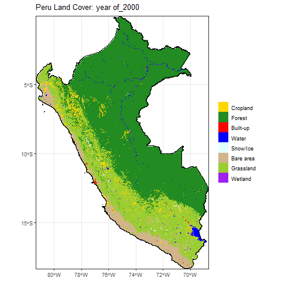

---
format:
  revealjs:
    title-slide: false
    theme: black
    slide-number: true
    transition: fade
    background-transition: fade
    incremental: false
    embed-resources: true
    center: true
    controls: true
    progress: true
    code-overflow: wrap
  
css:
  - ../slide_theme/custom.scss

editor_options:
  chunk_output_type: console
---
## {background-color="#111111"}

<div class="cover-slide">

<div class="cover-image">

</div>

<div class="cover-text">
<h1>Peru Land Cover Change Analysis</h1>
<p class="cover-subtitle">Spatial Data Analysis Final Project</p>
<p class="cover-author">Dylan Gong</p>
</div>

</div>

## Why I Chose This Topic

**Key Reason (story)**: 

- My friends invited me to go Hiking from Cusco to Machu Picchu, which is located in Peru. Gaining some prior knowledge before the trip.

- The country includes very different environments, such as the Amazon forest, the Andes, and coastal dry regions. Quite suitable for land cover change analysis.

## Research Question:


**How did major land cover types in Peru change from 2000 to 2020, and did they follow different trajectories?**

### In this project, I focus on:
- **Forest**
- **Cropland**
- **Built-up land**

## Data:

- **Data source:** Copernicus Climate Data Store (CDS)  
- **Website:** https://cds.climate.copernicus.eu/
- **Dataset:** ESA CCI / C3S annual land cover products (only focus on [lccs_class] layer)  
- **Study area:** Longitude: 82°W to 68°W Latitude: 19°S to 0°N (approximately)
- **Time span:** 2000–2020  
- **Spatial resolution:** 300 m 

## Method Overview {.smaller} 

1. **Prepare and reclassify annual land cover data**
   - Read annual files (2000–2020)
   - Extract the `lccs_class` layer
   - Crop and mask to Peru
   - Combine annual layers into `lc_stack`

2. **Build and visualize the land cover stack**
   - Create an animated overview of land cover change

3. **Apply category-specific trajectory analysis**
   - Create binary rasters for forest, cropland, and built-up
   - Convert binary rasters to area
   - Compare temporal trajectories
  

## Step 1. Prepare and reclassify into new Land Cover Stack

```r
library(terra)
library(geodata)
library(here)
library(dplyr)
library(tidyterra)
library(sf)

# order and extract raw data
order_files <- c(
  sprintf("ESACCI-LC-L4-LCCS-Map-300m-P1Y-%s-v2.0.7cds.area-subset.0.-68.-19.-82.nc", 2000:2015),
  sprintf("C3S-LC-L4-LCCS-Map-300m-P1Y-%s-v2.1.1.area-subset.0.-68.-19.-82.nc", 2016:2020)
)
all_files <- here("extdata", order_files)
years <- 2000:2020

lc_reclassify <- function(lyr){
  # Define new classes
  cropland_vals <- c(10, 11, 12, 20, 30, 40)
  forest_vals <- c(50, 60, 61, 62, 70, 71, 72, 80, 81, 82, 90,160,170)
  builtup_vals <- c(190)
  water_vals <- c(210)
  ice_vals <- c(220)
  bare_vals <- c(200, 201, 202)
  grass_vals <- c(100, 110, 120, 121, 122, 130, 150, 151, 152, 153)
  wetland_vals <- c(180)

  # Reclassify
  new_lyr <- lyr
  values(new_lyr) <- 0
  new_lyr[lyr %in% cropland_vals] <- 1
  new_lyr[lyr %in% forest_vals] <- 2
  new_lyr[lyr %in% builtup_vals] <- 3
  new_lyr[lyr %in% water_vals] <- 4
  new_lyr[lyr %in% ice_vals] <- 5
  new_lyr[lyr %in% bare_vals] <- 6
  new_lyr[lyr %in% grass_vals] <- 7
  new_lyr[lyr %in% wetland_vals] <- 8

  return(new_lyr)
}

# Peru boundary
peru <- gadm(country = "PER", level = 0, path = tempdir())
con_layer <- rast(all_files[1])[["lccs_class"]]
peru <- project(peru, crs(con_layer))
peru_sf <- st_as_sf(peru)

# Build the annual land cover stack
all_layers <- lapply(1:length(all_files), function(i) {lc_rast <- rast(all_files[i])[["lccs_class"]]
  lc_reclass <- lc_reclassify(lc_rast)
  lc_peru <- mask(crop(lc_reclass, peru), peru)
  levels(lc_peru) <- data.frame(value = 1:8,
                                label = c("Cropland", "Forest", "Built-up", "Water","Snow/Ice",
                                          "Bare area", "Grassland", "Wetland"))
  names(lc_peru) <- paste0("year of", years[i])
  lc_peru
})
lc_stack <- rast(all_layers)

#Save the stack
writeRaster(
  lc_stack,
  here("processed_data", "lc_stack_2000_2020.tif"),
  overwrite = TRUE
)

```

## Step 2. Visualize Annual Land Cover Change

```r
library(terra)
library(geodata)
library(here)
library(dplyr)
library(ggplot2)
library(tidyterra)
library(sf)
library(gganimate)

# Define a fixed color for each land cover category
fill_vals <- c(
  "Cropland" = "gold",
  "Forest" = "forestgreen",
  "Built-up" = "red",
  "Water" = "blue",
  "Snow/Ice" = "lightcyan",
  "Bare area" = "tan",
  "Grassland" = "yellowgreen",
  "Wetland" = "purple"
)

# Build the animated land cover map
anim <- ggplot() +

  # Draw the raster stack and assign category labels/colors
  geom_spatraster(
    data = lc_stack,
    aes(fill = factor(after_stat(value), levels = 1:8, labels = names(fill_vals)))
  ) +

  # Overlay the Peru boundary
  geom_sf(data = peru_sf, fill = NA, color = "black", linewidth = 0.2) +

  # Animate the layers over time
  transition_states(lyr, transition_length = 2, state_length = 1) +

  # Apply the manual color scale
  scale_fill_manual(values = fill_vals, na.translate = FALSE) +

  # Keep the spatial extent fixed
  coord_sf(expand = FALSE) +

  # Add the title and remove the legend title
  labs(title = "Peru Land Cover: {closest_state}", fill = NULL) +

  theme_bw()

# Export the animation as a GIF
animate(
  anim,
  nframes = 100,
  fps = 10,
  renderer = gifski_renderer(here("Project_Image", "peru_land_cover.gif"))
)
```

## Animated Overview of Land Cover Change 

<div style="text-align: center;">

{width=60%}

</div>

<div class="small" style="text-align: center; margin-top: 0.3em;">

Annual land cover change in Peru from 2000 to 2020.

</div>
